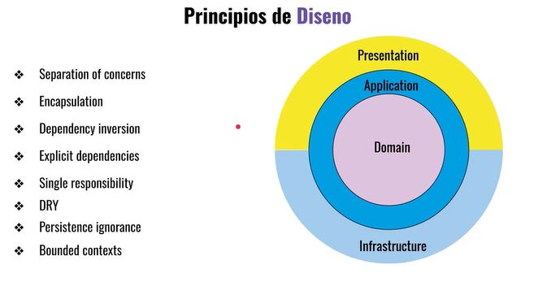
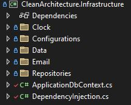
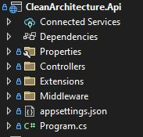
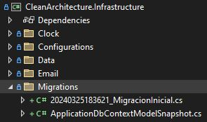

# Clean architecture y Domain Driven Design

Ejercicios tomados del curso de .Net University en Udemy: **Clean Architecture y Domain Driven Design en ASP.NET Core 8**, y complementado con apuntes propios.

---

# Índice completo de contenidos 📋
1. **[Clean architecture en .NET](#Seccion_01_Clean)**
2. **[Capa de Domain](#Seccion_02_Capa_Domain)**
3. **[Capa de Application](#Seccion_03_Capa_Application)**
4. **[Capa de Infrastructure](#Seccion_04_Capa_Infrastructure)**
5. **[Capa de presentación - Web API](#Seccion_05_Capa_Presentacion_WebApi)**
 
---

# Toma de contacto  🚀 

## Principales puntos 📋
* Por completar.
* Uso de Central Package Management (CPM) para paquetes Nuget
https://learn.microsoft.com/en-us/nuget/consume-packages/central-package-management

## Pre-requisitos 📋
Como herramientas de desarrollo necesitarás:
* Visual Studio 2022 (con la versión para .NET 8)
* Acceso para Postgre SQL, ya que la base de datos es de este tipo, con una de las siguientes versiones:
	* (Versión utilizada en el ejemplo) Usar una base de datos en local descargando [PostgreSql](https://www.postgresql.org/).
	* Usar una base de datos de PostgreSql online [Neon.Tech](https://neon.tech/).

## Antes de comenzar... entiende la base de datos que vamos a utilizar ⚙️
Los ejemplos se realizan sobre una base de datos de alquileres de coches.

## Agradecimientos 🎁

* Plataforma de aprendizaje online [Udemy](https://www.udemy.com/share/109PRS3@gz4ZDXhSu8i9pa_CnjiahHDgwCptf9vw-CYR0FqedgI2UGsgwy4nmPTe3ehw5QaGMA==/)
* A cualquiera que me invite a una cerveza 🍺.

---

# SECCIÓN 01. Clean architecture en .NET 

---

# SECCIÓN 02. Proyecto CleanArchitecture.Domain 

**Se trata del corazón del negocio:**

**Estructura de carpetas:**

**CleanArchitecture.Domain.Abstractions:**
* `public abstract class Entity`: para identificar entidades, y poner un `Guid` a las clases de tipo entidad. La propiedad tiene como setter `init`,  Init indica que una vez que ha sido inicializada la propiedad, no se puede cambiar su valor.
* `public interface IDomainEvents : INotification`: para configurar eventos de dominio. La entidad base `Entity`, manejará estos eventos.

**Principales características de una entidad de dominio:**
* Clase `sealed`: para que esté sellada.
* Debe tener un identificador, debe heredar de la clase abstracta `Entity`.
* Propiedades con setter `private set`: para cambiar los valores se deberá hacer a través de métodos.
* Constructor privado. Existirá un factory method llamado `Create` para la cración de la clase.

**Creación de Value objects:**
* Ejemplos con records simples: Direccion, Modelo, Vin. Aportan legibilidad al negocio. Representados como records, por lo que no cambian de valor.
* Ejemplos con records complejos: `TipoMoneda`, `Moneda`.

**Creación de eventos de dominio y notificaciones:**
* Para cambios en el estado de una entidad.
* Creados a través del paquete Nuget `MediatR.Contracts`.
* Ejemplos:  `Alquileres/AlquilerCanceladoDomainEvent`, `Users/UserCreatedDomainEvent`.

**Creación de **servicios de dominio**:**
* Un ejemplo es la clase `PrecioService`, para realizar cálculos de precios.

**Creación de los contratos de acceso a base de datos (repositorios) y persistencia (unit of work):**
* Repositorios: ejemplo `IUserRepository`.
* Unit of work: ejemplo `IUnitOfWork`.

**Creación de objetos de Results:**
* Clase `Abstractions/Result`: clase para poder devolver resultados estructurados.
* Clase `Abstractions/Error`: clase para poder devolver errores estructurados. Posteriormente se crearán errores propios de cada dominio (por ejemplo, de tipo `AlquilerErrors`).

**Objetos shared en Domain Model:**
* Dentro del modelo hay componentes que se va a reusar dentro de las entidades.
* Por ejemplo: `Shared/TipoMoneda`, `Shared/Moneda`.

---

# SECCIÓN 03. Proyecto CleanArchitecture.Application 

**Estructura de carpetas:**

**Paquetes Nuget:**
* Uso de `MediatR`: MediatR es una implementación del patrón mediador que ocurre completamente en el mismo proceso de la aplicación (in-process), y es una herramienta fundamental para crear sistemas basados en CQRS. Toda la comunicación entre el usuario y la capa de persistencia se gestiona a través de MediatR.
* Uso de `Dapper`.

**Carpeta `Abstractions`, que dentro contiene, entre otros:**
* Carpeta `Behaviours` (Interceptores para *cross cutting concerns): en esta carpeta se encuentran los interceptores:
	* `LoggingBehavior`: interceptor que captura todos los request que envíe el cliente, al insertar un nuevo record de tipo Command que implementen IBaseCommand. Comportamiento para registrar información de log al ejecutar commands (IBaseCommand).
	* `ValidationBehavior`: interceptor que captura las solicitudes de comando antes de ser manejadas por los controladores correspondientes para validar sus datos meciante Fluent Validation.
* Carpeta `Messaging`: en esta carpeta se encuentran las interfaces relacionadas con el manejo de mensajes dentro de la aplicación.
	* Interfaces para **Queries**: 
		* `IQuery`: Define una interfaz para las consultas que devuelven un resultado.
			* Por ejemplo, para devolver todos los usuarios, se crearía la clase `ConsultasUsuarioQuery`.
		* `IQueryHandler`: Define una interfaz para los controladores de consultas.
			* Por ejemplo, para manejar consultas relacionadas con usuarios, se crearía una clase que implemente esta interfaz, como `ConsultasUsuarioQueryHandler`.
	* Interfaces para **Commands**: 
		* `ICommand`: Define una interfaz para los comandos que no devuelven ningún resultado.
			* Por ejemplo, para crear un usuario, se crearía la clase `UsuarioCommand`.
		* `ICommandHandler`: Define una interfaz para los controladores de comandos.
			* Por ejemplo, para manejar comandos relacionados con usuarios, se crearía una clase que implemente esta interfaz, como `UsuarioCommandHandler`.

**Carpeta `Exceptions`, que dentro contiene, entre otros:**
* Clase `ValidationException`, que contiene una lista de errores de tipo `ValidationError`.

**Carpeta `Alquileres`, que dentro contiene la lógica de alquileres, entre otros**:
* Lógica para gestionar alquileres, con sus correspondientes Query, Command, etc.
* Esta lógica tiene encuentra errores de concurrencia `ConcurrencyException`.

**Carpeta `Vehiculos`, que dentro contiene la lógica de vehículos, entre otros**:
* Lógica para buscar vehículos, con sus correspondientes Query.

**Clase `DependencyInjection.cs`, encargada de la inyección de dependencias, por ejemplo, de**:
* Registrar los servicios, como por ejemplo `PrecioService`.
* Registrar los datos necesarios de `MediatR`, como los Command, Queries y sus respectivos Handlers a través del patrón Mediator.

---

# SECCIÓN 04. Proyecto CleanArchitecture.Infrastructure 

**Estructura de carpetas:**

**Paquetes Nuget:**
* Uso de `EFCore.NamingConventions`, `Microsoft.EntityFrameworkCore`, `Microsoft.EntityFrameworkCore.Tools`, `Npgsql.EntityFrameworkCore.PostgreSQL`.

**Carpeta `Configurations`, que dentro contiene, los mapeos de las entidades a las tablas de base de datos.**

**Carpeta `Data`, con las configuraciones necesarias para Dapper:**
* `SqlConnectionFactory`, factoría de conexión que se utilizará para Dapper (consultas). Implementa la interfaz `ISqlConnectionFactory`.
* `DateOnlyTypeHandler`, clase para manejar la conversión entre el tipo de datos .NET DateOnly y el tipo de datos de la base de datos.

**Carpeta `Clock`, que dentro contiene la implementación de la interfaz `IDateTimeProvider`. Esta implementación va a ser:
* `internal`, ya que vamos a utilizar la interfaz, que sí será pública.
* `sealed`, ya que va a estar sellada y no permititrá su herencia.

**Carpeta `Email`, que dentro contiene la implementación de la interfaz `EmailService`. Esta implementación va a ser:
* `internal`, ya que vamos a utilizar la interfaz, que sí será pública.
* `sealed`, ya que va a estar sellada y no permititrá su herencia.
* Se trata de una simulación de envío no implementado.

**Carpeta `Repositories`, que dentro contiene la implementación de las interfaces de dominio `IAlquilerRepository`, `IUserRepository`, etc.

**Clase `ApplicationDbContext.cs`, Clase que representa el contexto de la base de datos de la aplicación, se encarga de**:
* Configurar el modelo de la base de datos.
* Guardar los cambios en la base de datos y publicar los eventos de dominio asociados mediante el publisher de `MediatR`.
* Controlar los *errores por concurrencia optimista*. Para más info, revisar `ReservarAlquilerCommandHandler.cs` y `VehiculoConfiguration.cs` (añade una columna de versión en cada fila para registros optimistas).

**Clase `DependencyInjection.cs`, encargada de la inyección de dependencias, por ejemplo, de**:
* Registrar los servicios, como por ejemplo `DateTimeProvider` y `EmailService`.
* Registro de la base de datos.

---
# SECCIÓN 05. Proyecto CleanArchitecture.Api 

**Estructura de carpetas:**

## Preparación de la migración para base de datos
Seguir los siguientes pasos para crear una migración inicial:
1. Ir al Package Manager Console y situarse en el proyecto `CleanArchitecture.Api`.
2. Ejecutar:
`
dotnet tool install --global dotnet-ef
`

	El comando `dotnet tool install --global dotnet-ef` se utiliza para instalar la herramienta global `dotnet-ef`. Esta herramienta forma parte de la plataforma .NET Core y se utiliza para interactuar con Entity Framework Core (EF Core) desde la línea de comandos.
	- `dotnet tool install`: Es el comando principal para instalar herramientas .NET Core.
	- `--global`: Especifica que la herramienta se instalará de forma global en el sistema, lo que significa que estará disponible en cualquier directorio y para cualquier proyecto.
	- `dotnet-ef`: Es el nombre de la herramienta que se está instalando, que se utiliza para ejecutar comandos relacionados con Entity Framework Core, como la creación de migraciones y la actualización de la base de datos.

3. Ejecutar:
`
dotnet ef --verbose migrations add MigracionInicial -p src/CleanArchitecture.Infrastructure -s src/CleanArchitecture.Api
`

	Esta línea de comando ejecuta EF Core en un entorno detallado (--verbose) para agregar una migración con el nombre "MigracionInicial" a un proyecto. Aquí está la explicación detallada:
	- `dotnet ef`: Inicia la herramienta CLI (Command Line Interface) de Entity Framework Core.
	- `--verbose`: Esta bandera indica que la salida será detallada, proporcionando más información durante la ejecución.
	- `migrations add MigracionInicial`: Agrega una nueva migración al proyecto actual con el nombre "MigracionInicial". Las migraciones en Entity Framework Core se utilizan para realizar cambios en la estructura de la base de datos y se aplican a través del proceso de migración.
	- `-p src/CleanArchitecture.Infrastructure`: Especifica la ruta del proyecto donde se encuentran los archivos de la infraestructura de la aplicación. En este caso, los archivos del proyecto se encuentran en el directorio `src/CleanArchitecture.Infrastructure`.
	- `-s src/CleanArchitecture.Api`: Especifica la ruta del proyecto de inicio donde se encuentran los archivos de la API de la aplicación. En este caso, los archivos del proyecto de inicio se encuentran en el directorio `src/CleanArchitecture.Api`.

4. Resultado:
Si todo ha ido correctamente, habrá creado una migración como:

6. Una vez creadas las migraciones, la clase `program.cs` del proyecto `CleanArchitecture.Api` llamará a:
	- `ApplicationBuilderExtensions.ApplyMigration` para ejecutar las migraciones.
	- `SeedDataExtensions.SeedData` para generar datos por defecto. Utiliza la librería `Bogus` para introducir datos fake.

7. Ejecutar el proyecto `CleanArchitecture.Api`, y se creará tanto la base de datos como datos en las tablas.

## Captura de excepciones
La aplicación utiliza el Middleware `ExceptionHandlingMiddleware` para capturar las excepciones y mostrarlas de una forma entendible para el cliente.
En caso de que se produzca un error, se devolverá un [ProblemDetails](https://datatracker.ietf.org/doc/html/rfc7807), el cual es un estándar de devolución de errores.

## Los controladores
Existen dos controladores dentro de la API:
* `AlquileresController`: con 1 método get para retornar los alquileres y 1 método post para insertar.
* `VehiculosController`: con 1 método get para retornar los vehículos.

## Ejecución de la api
La ejecución de la Api se puede realizar desde:
* **Postman**: se incluye en la carpeta "docs" un environment y una colección con batería de pruebas de postman. Se debe tener en cuenta que los guids de las consultas quizás no coincidan ya que son autogenerados.
* **Swagger**.