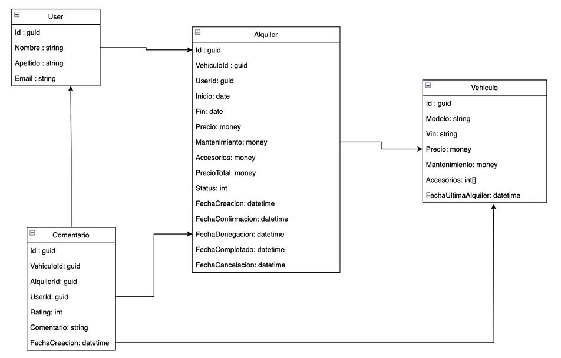
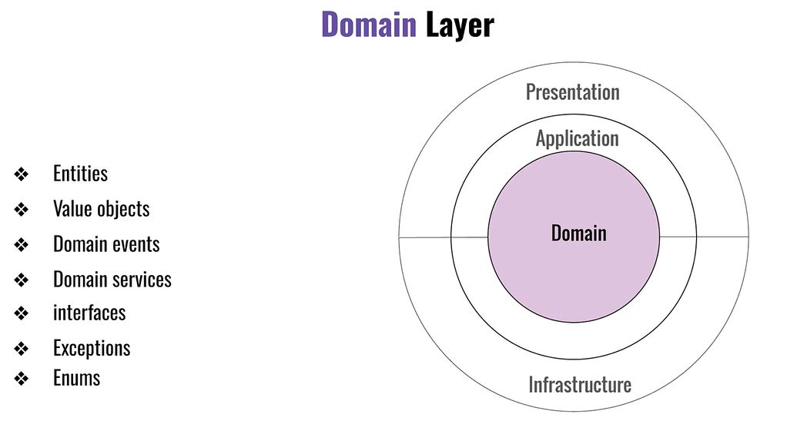

# Clean architecture y Domain Driven Design

Ejercicios tomados del curso de .Net University en Udemy: **Clean Architecture y Domain Driven Design en ASP.NET Core 8**, y complementado con apuntes propios.


# Índice completo de contenidos 📋
1. **[Clean architecture en .NET](#Seccion_01_Clean)**
2. **[Capa de Domain](#Seccion_02_Capa_Domain)**


# Toma de contacto  🚀 <a name="Toma_Contacto"></a>

## Principales puntos 📋
* Por completar.
* Uso de Central Package Management (CPM) para paquetes Nuget
https://learn.microsoft.com/en-us/nuget/consume-packages/central-package-management

## Pre-requisitos 📋
Como herramientas de desarrollo necesitarás:
* Visual Studio 2022 (con la versión para .NET 8)
* SQL Server (con la versión Express es suficiente)
* Tener instalado el [Command-line interface (CLI) de EF](https://learn.microsoft.com/en-us/ef/core/cli/dotnet). Ejecutar en un cmd:
```
dotnet tool install --global dotnet-ef
```

## Antes de comenzar... entiende la base de datos que vamos a utilizar ⚙️
Los ejemplos se realizan sobre una base de datos de alquileres de coches.


## Agradecimientos 🎁

* Plataforma de aprendizaje online [Udemy](https://www.udemy.com/share/109PRS3@gz4ZDXhSu8i9pa_CnjiahHDgwCptf9vw-CYR0FqedgI2UGsgwy4nmPTe3ehw5QaGMA==/)
* A cualquiera que me invite a una cerveza 🍺.

# SECCIÓN 01. Clean architecture en .NET <a name="Seccion_01_Clean"></a>


# SECCIÓN 02. Proyecto CleanArchitecture.Domain <a name="Seccion_02_Domain"></a>

**CleaArchitecture.Domain.Abstractions:**
* ```public abstract class Entity```: para poner un ```Guid``` a las clases de tipo entidad. La propiedad tiene como setter ``init``,  Init indica que una vez que ha sido inicializada la propiedad, no se puede cambiar su valor.

**Principales características de una entidad de dominio:**
* Clase ```sealed```: para que esté sellada.
* Debe tener un identificador, debe heredar de la clase abstracta ```Entity```.
* Propiedades con setter ```private set```: para cambiar los valores se deberá hacer a través de métodos.

**Creación de Value objects:**
* Ejemplos con records simples: Direccion, Modelo, Vin. Aportan legibilidad al negocio. Representados como records, por lo que no cambian de valor.
* Ejemplos con records complejos: TipoMoneda, Moneda.