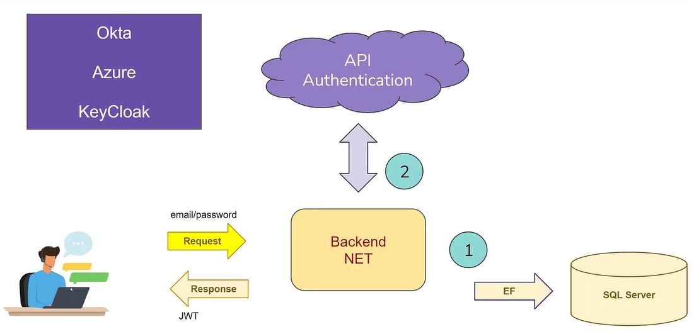
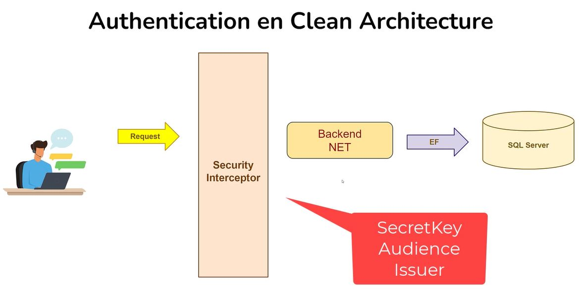

# Clean architecture y Domain Driven Design - avanzado

Ejercicios tomados del curso de .Net University en Udemy: **Clean Architecture y Domain Driven Design en ASP.NET Core 8 avanzado**, y complementado con apuntes propios.
Para poder realizarlo, es necesario tener claro el curso anterior: **Clean Architecture y Domain Driven Design en ASP.NET Core 8**

---

# Índice completo de contenidos 📋
1. **[Strong Ids](#Seccion_01_StrongIds)**
2. **[Modelos de authentication en clean architecture](#Seccion_02_Authentication)**
3. **[Seguridad y migración de EF en Clean Architecture](#Seccion_03_Migracion)**

---

## Agradecimientos 🎁

* Plataforma de aprendizaje online [Udemy](https://www.udemy.com/share/109PRS3@gz4ZDXhSu8i9pa_CnjiahHDgwCptf9vw-CYR0FqedgI2UGsgwy4nmPTe3ehw5QaGMA==/)
* A cualquiera que me invite a una cerveza 🍺.

---

# SECCIÓN 01. Clean architecture en .NET 

**¿Qué son los strong ids?:**
* En el contexto del Domain-Driven Design (DDD), los Strong IDs (identificadores fuertes) son una técnica para gestionar identificadores de entidades de manera segura y expresiva.
* En resumen, en vez de utilizar `Guid`, utilizaremos `UserId`, `AlquilerId`, etcétera.

**¿Qué implicaciones tiene?:**
* Al utilizar strong ids, la generación no es directa. Esto implica, por ejemplo, tener que crear una interfaz `IEntity` para poderla utilizar en la clase `ApplicationDbContext`.

---

# SECCIÓN 02. Modelos de authentication en clean architecture 

APis de autenticación externas para sistemas distribuidos: Okta, Azure (Microsoft Entra ID), KeyCloak, etcétera.

## Nugets utilizados
- `BCrypt.Net-Next`, en la capa Application. Se trata de un nuget para encriptación / desencriptación de passwords. 
- `Microsoft.AspNetCore.Authentication.JwtBearer`, en la capa Infrastructure. Se trata de Nuget para uso de Json Web Token.

## Conceptos básicos de JWT

### Diferencias entre Secret Key, Audience e Issuer

En el contexto de autenticación y seguridad, especialmente en sistemas basados en tokens como JWT (JSON Web Tokens), los términos "secret key", "audience" e "issuer" tienen roles y significados específicos. Aquí están las diferencias entre ellos:

#### Secret Key (Clave Secreta)
- **Propósito**: Es utilizada para firmar y, en algunos casos, para cifrar los tokens. Garantiza que el token no ha sido alterado y confirma la autenticidad del emisor.
- **Uso**: Al crear un JWT, se usa la clave secreta para firmar el token. Cualquier receptor del token puede verificar su autenticidad utilizando la misma clave.
- **Características**: Debe ser mantenida en secreto, sólo conocida por el servidor o servicio que emite y valida los tokens. Si se compromete, los tokens firmados con esa clave pueden ser falsificados.
- **Ejemplo**: `"mySuperSecretKey12345"`

#### Audience (Audiencia)
- **Propósito**: Especifica a quién está destinado el token, es decir, quién debe aceptar y procesar el token.
- **Uso**: Al crear un JWT, el emisor puede incluir un reclamo `aud` (audiencia) que contiene una cadena o una lista de cadenas que identifican a los destinatarios previstos. Cuando un servicio recibe un token, debe verificar que su identidad coincide con uno de los valores de la audiencia.
- **Características**: Ayuda a garantizar que el token no sea utilizado por entidades no autorizadas.
- **Ejemplo**: `"my-api-users"`, `["service1", "service2"]`

#### Issuer (Emisor)
- **Propósito**: Indica quién emitió el token.
- **Uso**: Al crear un JWT, el emisor incluye un reclamo `iss` (emisor) que contiene una cadena que identifica al emisor del token. Cuando un servicio recibe un token, debe verificar que el emisor coincide con el valor esperado.
- **Características**: Ayuda a garantizar que el token provenga de una fuente confiable.
- **Ejemplo**: `"auth.mycompany.com"`

#### En resumen:
- **Secret Key** es una clave de seguridad usada para firmar y validar la autenticidad de los tokens.
- **Audience** es un reclamo en el token que especifica quién debe aceptar el token.
- **Issuer** es un reclamo en el token que identifica quién emitió el token.

## Creación de clases para JWT

Hay que tener en cuenta que la autenticación contiene dos pasos:
- Generación de un JWT para dárselo al usuario.
- Validación cada vez que se haga una solicitud del recurso por parte del usuario, siempre y cuando el recurso esté protegido.

A continuación se describen las clases que intervienen:

**Capa "CleanArchitecture.Domain"**

- Record `PasswordHash`: para almacenar en Bdd con un valor seguro el password.
- Clase `PasswordHash`: incluyendo `PasswordHash`.
- Interfaz `IUserRepository`: se incluye GetByEmailAsync.

**Capa "CleanArchitecture.Infrastructure"**
- Clase Configurations/`UserConfiguration`: configuración del password.
- Interfaz Repositories/`IUserRepository`: se incluye GetByEmailAsync.
- Clase Authentication/`JwtProvider`: encargada de crear el token.
- Clase Authentication/`JwtOptions`: encargada de recoger los settings que utilizará `JwtProvider`.

- **Capa "CleanArchitecture.Application"**
- Interfaz Authentication/`IJwtProvider`: contrato que implementa `JwtProvider`.
- Se inluye toda la configuración de LoginUser: Users/LoginUser:
	- `LoginCommand`, `LoginCommandHandler`, `LoginUserRequest`.

- **Capa "CleanArchitecture.Api"**
- Clase `JwtBearerOptionsSetup`, configura las opciones de autenticación JWT para la aplicación.
- Clase `UsersController`, necesario para conseguir un JWT. Debe ser `[AllowAnonymous]`.
- Clase `VehiculosController`, configura un método que solo se puede acceder si se tiene un Jwt válido. Debe ser `[Authorize]`.

# SECCIÓN 03. Seguridad y migración de EF en Clean architecture 

- Clase `UsersController`: se ha creado el método `Register` de usuarios, que espera:
`
{
  "email": "string",
  "nombre": "string",
  "apellidos": "string",
  "password": "string"
}
`

A su vez, usa las clases:
- `RegisterUserCommand.cs`
- `RegisterUserCommandHandler.cs`
- `RegisterUserCommandValidator.cs`
- `RegisterUserRequest.cs`